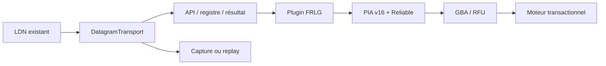

# Architecture du client d’échange Pokémon

Le cœur historique LDN reste propriétaire de la découverte, de
l’authentification, de l’adressage et de la restauration radio. Il remet une
session établie au port `DatagramTransport`; le reste du client ne reçoit ni
objets Wi-Fi mutables ni clé LDN.

Le contrat commun ne connaît pas PIA, RFU ou les structures Gen III. Ces
couches restent sous `pokemon_trade.games.frlg` jusqu’à ce qu’un second jeu
démontre une compatibilité filaire réelle.

Les résultats reçus restent en mémoire jusqu’à `trade_committed`. L’export est
une étape séparée, atomique, au-dessus de `TradeResult`; une interruption avant
commit ne crée donc aucun fichier `.pk3` partiel.
