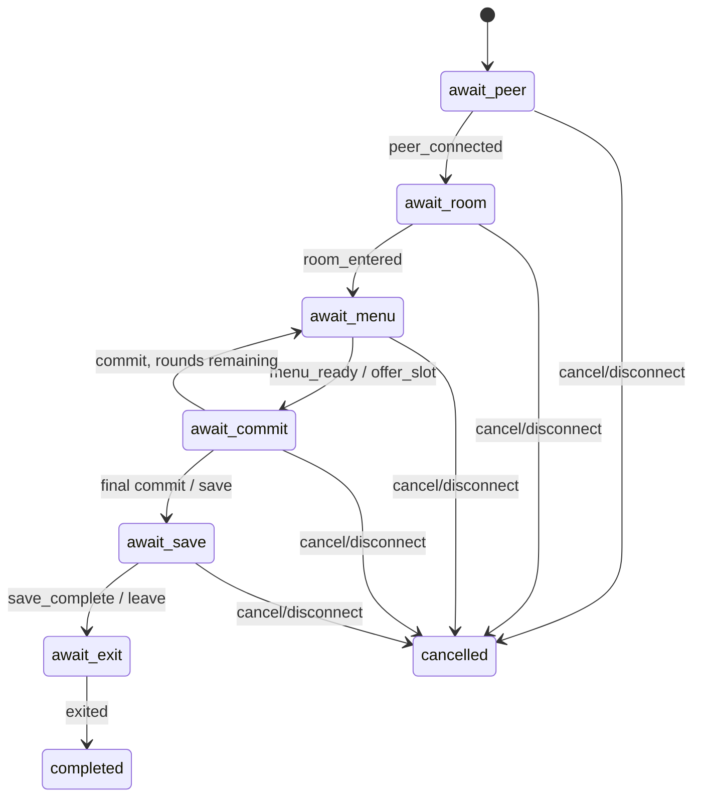
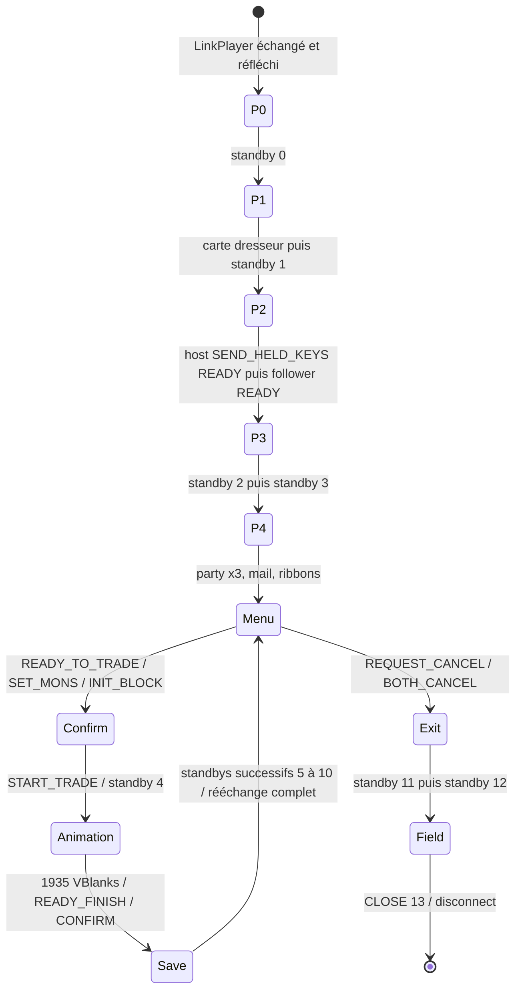

# Machine d’état d’échange FRLG

Cette page compare la réimplémentation à la branche `main` du dépôt
comportemental [`tornadus/frlg-ldn-trade`](https://github.com/tornadus/frlg-ldn-trade),
révision `13809c21b6e992097f98453b7cbc9e2bc30bbf7c` consultée le 4 septembre
2026. La référence sert de spécification observable ; aucun de ses modules
n’est importé ni copié.

Le moteur métier est séparé de PIA/RFU : l’adaptateur filaire ne lui transmet
que des preuves sémantiques. Les phases sont bornées et toute transition hors
ordre devient une erreur de protocole.

Un `.pk3` ne rejoint l’équipe locale et `TradeResult.received` qu’au signal
`trade_committed`, après validation de taille et checksum. Une déconnexion ou
annulation après un ou plusieurs commits retourne un résultat terminal partiel;
les rondes non commitées ne sont jamais exportables.

## Machine filaire de référence

L’état métier ci-dessus est volontairement plus petit que la machine filaire.
Le follower doit néanmoins parcourir toutes les coutures RFU suivantes :

Chaque bloc enfant reste en état `HOLD` après son dernier fragment jusqu’à ce
que le leader ait réfléchi le bloc complet dans le slot positionnel du follower.
Chaque nouveau slot `T` enfant consomme un crédit créé par un poll `T` du host.
Les barrières initiées avancent seulement après l’écho du même compteur ; une
rafale bornée peut être réarmée après environ 60 VBlanks sans réponse.

## Écart de la réimplémentation

| Propriété observable | État local | Conséquence |
| --- | --- | --- |
| Nonce PIA global strictement croissant | aligné | évite le rejet pré-Reliable de datagrammes qui reculent |
| `packet_id` indépendant par destination PIA | aligné | RTT/Session ne créent pas de trous dans Reliable |
| marqueur PIA `0x40` sur les ACK Reliable | aligné | le masque sélectif est présenté comme par les deux pairs natifs |
| un slot enfant par poll host, au plus un par VBlank | aligné | le follower ne court plus devant l’émulateur host |
| bloc enfant retenu jusqu’à réflexion complète du leader | aligné | la barrière suivante ne démarre plus avant l’installation du callback host |
| entrée LinkPlayer → standbys 0/1 → siège → standbys 2/3 | aligné pour le chemin nominal | `ROOM_ENTERED` exige désormais `SEND_HELD_KEYS`; les rafales post-siège sont réarmées |
| arrêt des held-keys dès `BufferTradeParties` | aligné | aucun `0xBE00` ne fuit dans les blocs de menu |
| horloges métier actives quand la fenêtre Reliable est pleine | aligné | l’animation ne s’allonge plus selon la congestion |
| standby 4 entre `START_TRADE` et la scène | aligné, validation live à refaire | débloque la couture menu/scène sans suspendre l’horloge d’animation |
| chaîne de sauvegarde initiée par le child, compteurs 5 à 10 | aligné, validation live à faire | chaque compte attend son écho; le retour de `BufferTradeParties` termine la chaîne |
| annulation unilatérale : retour au menu après 60 VBlanks | aligné, validation live à faire | le follower sélectionne de nouveau Annuler jusqu’au résultat mutuel |
| sortie : `BOTH_CANCEL`, standbys 11/12, puis `CLOSE` 13 | aligné, validation live à faire | le follower reste présent dans l’overworld et répond au close host |
| détection des barrières host dans tous les slots sauf notre reflet | partiel (slot host 0) | une disposition positionnelle différente peut masquer une barrière |
| refus Mew/Deoxys illégitime après 180 VBlanks | manquant | seul le chemin heureux est actuellement représenté |

Les lignes marquées « manquant » sont nécessaires à
la parité complète et aux essais de plusieurs échanges. Elles ne doivent pas
être simulées par un simple signal sémantique : les compteurs et leurs échos
doivent rester dans l’adaptateur RFU.
