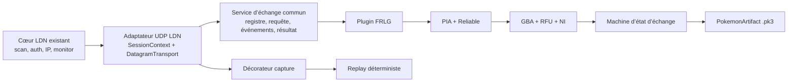

# Plan d’exécution — client abstrait d’échange Pokémon

## Approche retenue

Construire une architecture hexagonale au-dessus du cœur LDN existant. La frontière commune s’arrête volontairement à une session LDN décrite par des métadonnées immuables et à un flux bidirectionnel de datagrammes UDP. Le noyau commun connaît les demandes, événements, résultats, artefacts Pokémon et erreurs, mais ne connaît ni PIA, ni RFU, ni les états propres à FRLG.

La première extension, `frlg`, réimplémente indépendamment la pile observée dans `/home/lucas/Documents/frlg-ldn-trade/` : PIA, négociation de mesh, canal fiable, encapsulation GBA, RFU, échanges de blocs et machine d’état du salon d’échange. Le dépôt de référence est utilisé pour établir une spécification comportementale et des cas de test, jamais comme dépendance ni comme source de code copié.



### Frontières non négociables

- Ne pas modifier la sémantique de `ldn_protocol.py`, `Wifi/LdnStation.py`, `Wifi/LinuxMonitor.py`, `Wifi/LinuxRadioLease.py` ou `IEEE80211/`.
- Ne pas ajouter `ldn`, `frlgsim` ou `/home/lucas/Documents/frlg-ldn-trade/` aux dépendances ou aux imports du projet.
- Préserver intégralement `radio_lab.py --discovery-only` et le mode actuel d’écoute UDP/12345.
- Garder tout type PIA/RFU sous `pokemon_trade/games/frlg/`. Un futur deuxième jeu devra d’abord prouver qu’une couche est identique avant qu’elle soit promue dans le noyau commun.
- La bibliothèque retourne les Pokémon reçus sous forme d’artefacts en mémoire. Seule la couche d’export écrit des fichiers, et uniquement après le commit protocolaire.

### Arborescence cible

```text
pokemon_trade/
  __init__.py
  api.py                 # requêtes, résultats, événements, protocole TradeClient
  artifacts.py           # PokemonArtifact et export atomique
  errors.py              # taxonomie stable des erreurs
  registry.py            # résolution auto et override explicite
  service.py             # orchestration commune et émission d’événements
  transport/
    __init__.py
    base.py              # SessionContext, Datagram, DatagramTransport
    ldn_udp.py           # adaptateur de LdnConnection, sans logique LDN
    capture.py           # décorateur d’enregistrement versionné
    replay.py            # transport déterministe hors ligne
  games/
    __init__.py
    frlg/
      __init__.py
      descriptor.py      # signatures LDN et options FR/LG
      client.py          # composition de la pile et cadence live/replay
      pokemon.py         # .pk3, équipe, checksum, chiffrement Gen 3
      identity.py        # LinkPlayer, carte dresseur, charmap, NI GameData
      pia/
        packet.py        # header, messages, footer, zstd
        crypto.py        # clé de session, nonce, AES-GCM
        session.py       # Net, Session(new), RTT, IDs de station
        reliable.py      # fenêtre, ACK sélectifs, RTO, retransmissions
      gba/
        frame.py         # trames C/A/T/K/D de l’émulateur
        rfu.py           # slots NI/UNI et commandes link
        ni.py            # émission/réception NI
        blocks.py        # fragmentation et réassemblage
        barriers.py      # standby/close-link
      trade/
        model.py         # états et commandes métier FRLG
        engine.py        # entrée, menu, échange, commit, save, sortie
pokemon_trade_cli.py
docs/
  architecture/pokemon-trade-client.md
  protocols/frlg/{sources,wire-stack,state-machine,constants}.md
  guides/adding-a-game.md
  guides/frlg-trade.md
  testing/frlg-live.md
tests/
  pokemon_trade/
  fixtures/frlg/
```

Les noms pourront être légèrement regroupés si un module reste très petit, mais les dépendances doivent garder le même sens : `api/transport` ne dépend jamais de `games/frlg`, tandis que `frlg` dépend des ports communs.

## Étapes ordonnées

### 1. Figer la base et les preuves sans toucher au LDN

**Fichiers :** `docs/protocols/frlg/sources.md`, `docs/protocols/frlg/constants.md`, `tests/test_radio_lab.py`, nouveaux tests de garde d’architecture.

1. Enregistrer la base reproductible : commit `e0b6930af7b95642d6498387593a91e4d9397110` de `bring-back-home`, commit `6402b317031096eaf02f77b64b23ea28f938986a` du dépôt de référence et empreinte `16c989cd90541ea8a5986de44d58ab13bbd863b69b6636c6493cb50b24f7fd08` de son diff local au moment du plan. Ne jamais modifier ce second dépôt pendant l’implémentation.
2. Établir une table « fait public / observation de capture / hypothèse / inconnu ». Y placer les références : [LDN Protocol](https://github.com/kinnay/NintendoClients/wiki/LDN-Protocol), [Pia Overview](https://github.com/kinnay/NintendoClients/wiki/PIA-Overview), [Pia Protocol](https://github.com/kinnay/NintendoClients/wiki/Pia-Protocol), [Reliable Protocol](https://github.com/kinnay/NintendoClients/wiki/Reliable-Protocol) et la [décompilation pret/pokefirered](https://github.com/pret/pokefirered).
3. Documenter la session déjà observée (`communication_id=0x01006FA0233F8000`, scène `22287`, LDN v4, app `88`, UDP/12345) et la divergence avec la constante `0x0100610011000000` du dépôt de référence. Une signature non vérifiée ne doit jamais devenir un match automatique silencieux.
4. Ajouter des tests de non-régression pour l’aide CLI, `--discovery-only`, l’écoute brute et un garde d’import interdisant toute dépendance vers `ldn`/`frlgsim` dans le nouveau paquet.

**Vérification :**

```bash
uv run python -m unittest discover -s tests -v
uv run python radio_lab.py --help >/dev/null
git diff --exit-code -- ldn_protocol.py Wifi IEEE80211
```

### 2. Définir le contrat métier minimal et typé

**Fichiers :** `pokemon_trade/api.py`, `artifacts.py`, `errors.py`, `registry.py`, `service.py`, `tests/pokemon_trade/test_api.py`, `test_registry.py`, `test_architecture.py`.

1. Définir `GameDescriptor` avec un identifiant stable, un libellé, des signatures LDN supportées et une méthode pure de compatibilité avec `NetworkInfo`.
2. Définir `TradeRequest` comme structure immuable : équipe d’artefacts, emplacements offerts, nombre d’échanges, identité de joueur, variante de jeu et options propres au plugin dans un objet validé par celui-ci.
3. Définir `PokemonArtifact` : format (`pk3` pour FRLG), bytes, génération, nom suggéré et métadonnées non sensibles. `TradeResult` contient le statut terminal, les artefacts reçus ordonnés et l’équipe locale mise à jour.
4. Définir une union fermée `TradeEvent` pour `LDN_READY`, `PEER_CONNECTED`, `ROOM_ENTERED`, `MENU_READY`, `OFFERED`, `COMMITTED`, `SAVING`, `LEAVING`, `COMPLETED`, `CANCELLED`, `FAILED`. Les détails libres doivent être filtrés avant journalisation.
5. Définir le protocole async `TradeClient.run(transport, request, emit) -> TradeResult` et une méthode de validation sans effet de bord.
6. Créer la taxonomie : `UnsupportedGameError`, `InvalidArtifactError`, `MalformedDatagramError`, `CryptoError`, `ProtocolStateError`, `TradeTimeoutError`, `PeerDisconnectedError`, `TradeCancelledError`.
7. Le registre choisit le meilleur descripteur à partir du `NetworkInfo`; zéro match produit `UnsupportedGameError`, plusieurs matchs une erreur d’ambiguïté, et `--game frlg` permet un override diagnostique explicite.

**Vérification :** tests de construction/immutabilité, validation 1–6, ordre des artefacts, exhaustivité des événements, résolution auto/ambiguë/forcée et test AST des sens d’import. Ajouter `pyright` au groupe de développement et exécuter :

```bash
uv run pyright pokemon_trade pokemon_trade_cli.py
uv run python -m unittest discover -s tests -v
```

### 3. Créer le port datagramme et l’adaptateur LDN

**Fichiers :** `pokemon_trade/transport/base.py`, `ldn_udp.py`, `pokemon_trade/service.py`, éventuellement un petit module public `ldn_runtime.py`; tests `test_ldn_udp.py` et compléments à `test_ldn_client.py`.

1. `SessionContext` copie au moment de la connexion le SSID, le communication ID, la scène, la version applicative, le nom/interface, le participant local, l’hôte et le broadcast. Le plugin ne reçoit pas l’objet mutable `LdnConnection`.
2. `DatagramTransport` expose `session`, `async send(payload, destination)`, `async receive()` et `async aclose()`. `Datagram` conserve payload, IP/port source et destination et timestamp monotone ; aucun concept PIA n’apparaît ici.
3. `LdnUdpTransport` ouvre un socket UDP/12345 lié à `ldnclient` avec `SO_BINDTODEVICE`, `SO_REUSEADDR` et `SO_BROADCAST`. La réception utilise `trio.lowlevel.wait_readable`; l’envoi gère unicast hôte et broadcast du sous-réseau. Le transport rejette les ports/destinations hors session et ses propres datagrammes.
4. Un canal mémoire Trio sépare la lecture continue du moteur cadencé. L’exception de `connection.monitor()` annule la nursery du service et devient une erreur typée ; l’annulation du client ferme d’abord le protocole de jeu dans un délai borné, puis laisse `connect_ldn` et `LinuxRadioLease` restaurer le matériel.
5. Ajouter une orchestration publique qui compose les primitives existantes de découverte et `connect_ldn`, sans déplacer ni réécrire la logique radio. Si un helper de `radio_lab.py` doit être rendu public, le faire par extraction mécanique avec tests de sortie identique, pas par refonte.
6. Ne pas ajouter d’AF_PACKET au premier passage : le socket UDP actuel reçoit déjà PIA. Un fallback brut ne pourra être envisagé que sur preuve d’un datagramme visible en capture mais absent du socket UDP, et restera dans l’adaptateur, jamais dans le cœur LDN.

**Vérification :** faux socket et faux `LdnConnection`, envoi unicast/broadcast, filtrage, fermeture idempotente, propagation d’une déconnexion et annulation. Rejouer aussi les 27 tests LDN existants et vérifier qu’aucun fichier cœur n’a changé.

### 4. Ajouter capture et replay déterministes

**Fichiers :** `pokemon_trade/transport/capture.py`, `replay.py`, `tests/pokemon_trade/test_capture_replay.py`, `tests/fixtures/frlg/README.md`, `.gitignore`.

1. Définir un JSONL versionné : un enregistrement de session synthétisable puis des datagrammes `in/out` avec délai relatif, endpoints et payload hexadécimal. Ajouter une version de schéma dès le premier octet logique pour refuser proprement les formats futurs inconnus.
2. `CaptureTransport` décore n’importe quel transport sans connaître le jeu. Par défaut, les captures live sont locales, mode `0600`, ignorées par Git et annoncées comme sensibles.
3. `ReplayTransport` fournit le même contrat async avec une horloge manuelle : mode rapide sans sommeil, mode temporisé facultatif, contrôle exact des paquets émis et injection de pertes, doublons, réordonnancement et délais.
4. Les fixtures commitées sont générées avec SSID, IP, noms et Pokémon synthétiques. Une capture réelle ne devient jamais une fixture par simple chiffrement : elle doit être déchiffrée, expurgée, réencodée avec un contexte synthétique et vérifiée par un test de détection de secrets.

**Vérification :** round-trip capture/replay, déterminisme bit à bit sur deux exécutions, rejet d’un schéma inconnu et scanner de fixtures pour les identifiants interdits.

### 5. Spécifier FRLG avant de coder sa pile

**Fichiers :** `docs/protocols/frlg/wire-stack.md`, `state-machine.md`, `constants.md`, `docs/architecture/pokemon-trade-client.md`.

1. Décrire la pile complète sans reprendre la structure du code AGPL : UDP → paquet PIA chiffré/compressé → message Reliable → trame émulateur GBA → slot RFU NI/UNI → commande link/bloc → état d’échange.
2. Écrire les formats binaires offset par offset, endianness, bornes, valeurs versionnées et provenance. Séparer les constantes publiques PIA des constantes FRLG observées (clé de jeu, versions de protocoles, cadence de VBlank, tailles de blocs).
3. Décrire la machine d’état nominale : PIA Net/Session/RTT, ouverture Reliable, `C/A`, NI bidirectionnel, UNI, échange LinkPlayer/carte/équipe, siège droit follower, sélection, confirmation, animation, commit, barrières de sauvegarde, boucle 1–6, annulation et sortie.
4. Pour chaque timeout, indiquer le signal attendu, le délai initial, le comportement de retransmission et la sortie d’erreur. Toute constante mesurée reste configurable et annotée comme telle.
5. Faire relire la spécification contre le dépôt de référence, puis implémenter depuis cette spécification. Ne pas conserver un fichier source du dépôt de référence ouvert comme modèle lors de l’écriture du module correspondant.

**Vérification :** revue documentaire croisée : chaque champ encodé dans les étapes suivantes doit avoir une entrée de spec et chaque transition un événement/timeout ou une justification explicite.

### 6. Réimplémenter les artefacts Pokémon et identités FRLG

**Fichiers :** `pokemon_trade/games/frlg/pokemon.py`, `identity.py`, `descriptor.py`, tests `test_frlg_pokemon.py`, `test_frlg_identity.py`, fixtures synthétiques.

1. Implémenter lecture et validation `.pk3` : tailles Gen 3 acceptées, checksum, permutation des sous-structures, chiffrement/déchiffrement et normalisation en structure de parti de 100 octets. Les entrées de boîte de 80 octets peuvent être complétées de manière déterministe ; le résultat public FRLG reste un `.pk3` de 100 octets.
2. Implémenter l’équipe 1–6, les emplacements offerts distincts, la substitution locale après commit et l’export de bytes sans écriture implicite.
3. Implémenter les structures LinkPlayer, carte dresseur, texte Gen 3 et NI GameData avec langue/variante explicites. Ne journaliser ni OT complet ni contenu Pokémon par défaut.
4. Le descripteur FRLG contient uniquement les signatures vérifiées. Commencer avec l’ID observé dans ce projet ; conserver l’override explicite pour collecter la signature LeafGreen avant de l’ajouter au match automatique.

**Vérification :** vecteurs synthétiques indépendants pour encrypt/decrypt/checksum, rejet des tailles et checksums invalides, échange local simulé entre deux équipes, conservation exacte des 100 octets et tests FireRed/LeafGreen.

### 7. Réimplémenter PIA et la connexion de mesh dans le plugin FRLG

**Fichiers :** `games/frlg/pia/packet.py`, `crypto.py`, `session.py`, `reliable.py`; tests séparés par module.

1. `packet.py` encode/décode strictement la variante PIA observée : magic, version/flags, IDs variables source/destination, packet ID par canal, nonce, tag, taille footer, messages et padding. Refuser troncatures, tailles incohérentes et trailing bytes non permis.
2. `crypto.py` dérive la clé de session FRLG depuis le SSID et la clé spécifique au jeu, calcule le nonce LDN depuis network ID XOR IP source, puis applique AES-GCM. Ajouter Zstandard dans `pyproject.toml` et rendre la compression explicite/testable.
3. `session.py` apprend les IDs variables depuis le fil, répond à Net, construit Session(new), gère finalize/update/left et répond/origine RTT. Aucun ID de capture n’est codé en dur.
4. `reliable.py` implémente ouverture, fenêtre d’envoi, séquence wrap-around, ACK cumulatif/sélectif, buffer hors ordre, RTO fondé sur RTT, retransmission bornée et contrôle de congestion. Injecter horloge et source aléatoire pour des tests déterministes.
5. Tester les parseurs et constructeurs contre des vecteurs écrits depuis la documentation et des observations expurgées, pas en comparant deux fonctions du même module entre elles.

**Vérification :** corruption d’un bit AES-GCM, nonce/IP erroné, zstd on/off, séquences 65535→1, pertes/doublons/réordre, expiration de fenêtre et handshake complet avec faux pair PIA.

### 8. Réimplémenter la liaison GBA/RFU

**Fichiers :** `games/frlg/gba/frame.py`, `rfu.py`, `ni.py`, `blocks.py`, `barriers.py`; tests `test_frlg_gba_frame.py`, `test_frlg_rfu.py`, `test_frlg_blocks.py`, `test_frlg_barriers.py`.

1. Encoder/décoder les trames émulateur `C`, `A`, `T`, `K`, `D`, avec compteur `T`, ACK `K` une fois par timestamp unique et limites strictes.
2. Implémenter les slots RFU child NI/UNI, l’identifiant de commande modulo 8, les commandes link, keepalive, ready, standby et close.
3. Implémenter l’échange NI dans les deux sens ; l’ACK reçu doit refléter état/index/phase du host et cesser au `NULL` pour ne pas contaminer la phase UNI.
4. Implémenter fragmentation/réassemblage des blocs et ACK par pair, ainsi que les barrières réactives basées sur le compteur du leader.
5. Ne mettre dans cette couche aucune décision Pokémon : elle transporte des bytes et signale des événements RFU typés.

**Vérification :** golden vectors par type de trame, reconstitution de blocs avec ordre aléatoire/doublons, perte d’un fragment, NI complet/avorté et barrières avec compteurs en retard/en avance.

### 9. Implémenter la machine d’état FRLG et le client de jeu

**Fichiers :** `games/frlg/trade/model.py`, `engine.py`, `client.py`; tests `test_frlg_trade_engine.py`, `test_frlg_client.py`, faux host `tests/pokemon_trade/fakes/frlg_host.py`.

1. Découper l’état en sous-machines explicites plutôt qu’en un unique grand objet : entrée du salon, échange de données de joueur/équipe, menu, transaction, sauvegarde, sortie. Chaque transition reçoit un événement filaire et produit zéro ou plusieurs commandes.
2. Le client live avance à 59,727 Hz via une horloge injectée ; à chaque tick il draine les datagrammes entrants, fait avancer PIA/Reliable/RFU/Trade, puis émet les sorties. Le replay utilise la même boucle avec une horloge manuelle.
3. Reproduire le rôle follower/mpId 1 et le siège droit. Ne jamais émettre une opcode réservée au leader. Attendre les preuves filaires (LinkPlayer complet, NI/UNI, barrières) plutôt qu’un timer aveugle.
4. Pour chaque ronde : annoncer `OFFERED`, attendre la sélection/validation du host, lancer la séquence de commit, extraire le Pokémon choisi dans le parti reçu, remplacer l’emplacement offert et annoncer `COMMITTED` une seule fois.
5. Persister en mémoire les commits déjà acquis même si une ronde ultérieure échoue, mais retourner un résultat terminal explicitement partiel ; l’exporteur ne doit jamais présenter la ronde non commitée comme réussie.
6. Après N échanges, envoyer la demande d’annulation, répondre aux barrières de fermeture, attendre le signal de sortie/déconnexion dans un délai borné et annoncer `COMPLETED`. Sur Ctrl+C, tenter une sortie gracieuse courte avant annulation de la connexion LDN.
7. Les réglages sensibles au lien (fenêtre, RTO, seuil de compression, délais de barrières) vivent dans `FrlgProtocolTuning`, avec valeurs par défaut documentées et dump diagnostique sans données personnelles.

**Vérification :** faux host indépendant couvrant un échange, six échanges, refus, Pokémon partenaire invalide, abandon avant/après commit, déconnexion, save barriers, timeout de chaque phase et absence de double commit sous retransmission.

### 10. Exposer la bibliothèque et une CLI fine

**Fichiers :** `pokemon_trade/__init__.py`, `pokemon_trade_cli.py`, `pyproject.toml`, `tests/pokemon_trade/test_cli.py`, `README.md`.

1. Exposer une façade stable : résolution du jeu, validation de requête, exécution live/replay, stream d’événements et récupération des `PokemonArtifact`.
2. CLI proposée : `--game auto|frlg`, `--variant firered|leafgreen`, paramètres LDN existants, 1–6 `.pk3`, `--trades`, `--slots`, `--output-dir`, `--capture`, `--replay`, `--verbose`. Le mode replay ne requiert ni root ni clé Switch.
3. L’auto-détection refuse les sessions inconnues ; l’override affiche clairement qu’il est diagnostique si la signature LDN n’est pas encore approuvée.
4. Exporter chaque `.pk3` par fichier temporaire dans le répertoire cible, `fsync`, puis `os.replace` après commit. Pour plusieurs échanges, utiliser un nom déterministe incluant le numéro de ronde, sans nom de Pokémon issu du pair dans le chemin.
5. Garder `radio_lab.py` comme outil radio/observation distinct. La nouvelle CLI appelle la bibliothèque et n’héberge aucun parseur PIA/RFU.

**Vérification :** `--help`, erreurs d’arguments, session inconnue, export simple/multiple, interruption avant commit, replay sans privilèges et test que la CLI ne dépend que de la façade publique.

### 11. Durcir tests, confidentialité et documentation d’extension

**Fichiers :** toute la suite `tests/pokemon_trade/`, `docs/architecture/pokemon-trade-client.md`, `docs/guides/adding-a-game.md`, `docs/guides/frlg-trade.md`, `README.md`.

1. Ajouter un test d’intégration complet synthétique allant de `TradeRequest` à `TradeResult` via `ReplayTransport`, avec vérification du `.pk3` reçu et de l’ordre exact des événements.
2. Ajouter une matrice de fautes : paquets PIA invalides, tag incorrect, séquence perdue, duplication, réordre, timeout, fermeture LDN, annulation à chaque phase.
3. Scanner Git et les fixtures pour les extensions/chaînes sensibles ; vérifier aussi que les logs par défaut ne contiennent pas SSID, MAC, OT, hex dump de Pokémon ou passphrase.
4. Documenter le contrat de plugin et fournir une checklist obligatoire : collecter les signatures LDN, identifier le transport métier, réévaluer PIA/fiabilité, conserver les protocoles spécifiques dans le plugin, produire des fixtures synthétiques, puis seulement proposer une extraction commune avec preuves provenant d’au moins deux jeux.
5. Documenter FRLG de bout en bout, les gestes côté Switch, les variantes, les formats `.pk3`, les erreurs, le replay, la collecte d’une nouvelle signature et les limites connues.

**Vérification globale hors matériel :**

```bash
uv sync
uv run pyright pokemon_trade pokemon_trade_cli.py
uv run python -m unittest discover -s tests -v
PYTHONPYCACHEPREFIX=/tmp/bring-back-home-pyc uv run python -m compileall -q \
  ldn_protocol.py ldn_client.py radio_lab.py IEEE80211 Wifi pokemon_trade pokemon_trade_cli.py
uv run python radio_lab.py --help >/dev/null
uv run python pokemon_trade_cli.py --help >/dev/null
git diff --check
git diff --exit-code -- ldn_protocol.py Wifi IEEE80211
```

### 12. Validation matérielle AX200 et clôture

**Fichiers :** `docs/testing/frlg-live.md` et journal local ignoré par Git.

1. Avant chaque run : vérifier l’absence de client privilégié résiduel, recréer le salon Leader, préparer `mon0`, confirmer que `ldnclient` n’existe pas et noter kernel/firmware/version du projet.
2. Exécuter trois sessions consécutives sans changement de réglage. La matrice recommandée est : un échange FireRed, au moins un échange séquentiel de deux Pokémon, puis un échange LeafGreen. Si LeafGreen n’est pas disponible, la compatibilité LeafGreen reste explicitement non validée et l’objectif complet n’est pas déclaré terminé.
3. Pour chaque session : vérifier LDN prêt, handshake PIA, entrée du salon, commit, `.pk3` de 100 octets avec checksum valide, sortie gracieuse et disparition/restauration correcte des interfaces.
4. Ne conserver dans Git que le résultat expurgé (succès/échec, durées, versions, compteurs). Captures, clés, SSID, MAC, noms et Pokémon restent locaux et ignorés.
5. En cas d’échec, classer le dernier jalon atteint et rejouer la trace hors ligne avant toute modification du cœur LDN. Une correction de timing doit d’abord être prouvée par test de faute reproductible.

## Matrice faits → étapes

| Faits | Étapes principales |
|---|---|
| 01–03 | 1, 3, 10, 11 |
| 04–05 | 2, 10, 11 |
| 06–11 | 2, 3, 10 |
| 12–13 | 1, 5, 7–9 |
| 14–17 | 6, 9, 10 |
| 18–19 | 2, 3, 9 |
| 20–21 | 4, 7–9, 11 |
| 22 | 12 |
| 23 | 4, 10–12 |
| 24 | 1, 5, 11 |

## Risques et points à surveiller

- **Signature de jeu incertaine.** La session réellement vue et la constante du dépôt de référence divergent. Le registre doit partir des observations locales vérifiées, ne jamais utiliser « l’unique réseau joignable » comme preuve d’identité et conserver un override diagnostique.
- **LeafGreen pas encore prouvé localement.** Le protocole métier est partagé, mais communication ID, app data, langue et version doivent être capturés sur LeafGreen avant d’activer son auto-détection.
- **Réimplémentation indépendante.** Le même développeur ayant accès au dépôt AGPL, il ne faut pas qualifier juridiquement le travail de clean-room. Le contrôle praticable est : spécification de provenance, architecture différente, aucun import/copié-collé et vecteurs indépendants.
- **Temporisation très sensible.** Le lien AX200 a une longue traîne de latence ; une horloge injectable, les ACK sélectifs et les tests de faute sont requis avant tout réglage live.
- **Réception UDP.** Le socket UDP fonctionne déjà pour l’observation. Toute introduction future d’AF_PACKET doit être motivée par une capture comparative et rester isolée dans l’adaptateur.
- **Données sensibles.** Un datagramme PIA chiffré n’est pas considéré automatiquement anonymisé. Les fixtures commitées doivent être synthétiques ou réencodées après expurgation.
- **Documentation PIA évolutive.** Les pages NintendoClients décrivent plusieurs générations du protocole. L’implémentation FRLG doit verrouiller la variante réellement observée et refuser les versions inconnues plutôt que les interpréter approximativement.

## Condition de fin

Le but est atteint lorsque la bibliothèque et la CLI exécutent, via le cœur LDN inchangé, un à six échanges FRLG follower avec résultats `.pk3` récupérables, que le même chemin passe sur replay synthétique et sur trois sessions AX200 consécutives, que les erreurs/annulations nettoient correctement la radio, et que le guide d’ajout d’un jeu empêche explicitement de généraliser PIA/RFU sans preuve issue d’un second titre.
